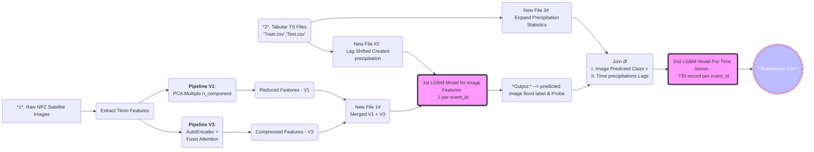

# **Urban Flood Detection Model Documentation**

## 1. Overview and Objectives

### Contest Background
In South Africa, flooding presents a significant hazard to both rural and urban regions, posing risks to communities, infrastructure, and local economies. Between 1981 and 2023, numerous floods were reported, though many urban flood events went underreported or lacked the detailed information necessary for advanced analysis and prediction.

The core problem is to **predict the specific day** an urban flash flood occurred using:
- **CHIRPS daily precipitation data** aggregated within a 5 km radius of reported flood points.
- **Composite earth observation (satellite) images** corresponding to each reported location.

The objective of this challenge is to produce a machine learning model that accurately identifies both the timing and likelihood of a flood event. This enriched historical record will enable the South African Environmental Observation Network (SAEON) to improve flood forecasting models, enhance early warning systems, and optimize emergency responses.

### Project Goals
1. **Develop a Complete Historical Flood Archive**: Provide daily-level flood occurrence predictions to fill gaps in the recorded data.
2. **Improve Disaster Preparedness**: Equip SAEON with robust, updated insights into patterns and frequencies of urban floods.
3. **Enhance Forecasting and Response**: Offer accurate, timely data to inform urban planning, resource allocation, and risk mitigation strategies.

---

## 2. Data Description

- **`train.csv`**  
  Contains historical event IDs, associated timestamps, and labels indicating whether a flood occurred on a particular day.
  
- **`test.csv`**  
  Holds the event IDs and corresponding time series records for which we need to predict flood occurrences.

- **`composite_images.npz`**  
  A NumPy archive file containing satellite image data. Each entry includes multiple spectral bands (e.g., RGB and other channels).

### Data Sources
1. **CHIRPS**: Daily precipitation data (aggregated within 5km of each flood point).
2. **Satellite Imagery**: Composite NPZ files, providing crucial remote sensing features indicative of surface water, vegetation, and land cover conditions.

## 3. Architecture and Workflow

Below is a high-level depiction of our end-to-end process:

## 4. Detailed Steps

### 4.1 Preprocessing and Feature Engineering

1. **Library Imports & Variable Declarations**  
   - Import necessary Python libraries (e.g., NumPy, Pandas, LightGBM, Timm, etc.).
   - Define constants and file paths (e.g., for `train.csv`, `test.csv`, and `composite_images.npz`).

2. **Satellite Image Processing**  
   - **Load Composite Images**: Read `composite_images.npz` into memory.
   - **Compute Statistical Features**: Calculate basic statistics (e.g., mean, standard deviation) for each image band.
   - **Extract Deep Features (Timm Library)**: Use various pretrained models to transform the images into high-dimensional feature vectors "Features Extraction".  

3. **Dimensionality Reduction / Advanced Feature Extraction**  
   - **Pipeline V1 (PCA)**:  
     - Apply Principal Component Analysis to reduce the dimensionality of the extracted  multiple times [16, 32, 64, 128, 256].  
   - **Pipeline V3 (AutoEncoder + Attention Fusion)**:  
     - Train an autoencoder to learn compressed representations of image features -- Instead of PCA.  
     - Integrate an attention mechanism for improved feature fusion between tabular and Deep Features.

4. **Selected Models for Feature Extraction**
   - **V1 Models**:
     1. `efficientnet_b3.ra2_in1k` (224×224 input size)  
     2. `resnet34` (224×224)  
     3. `vit_base_patch16_clip_224.openai` (224×224)  
     4. `resnet50` (224×224)  
     5. `vit_large_patch14_reg4_dinov2.lvd142m` (518×518)
   - **V3 Models**:
     1. `efficientnet_b3.ra2_in1k` (224×224)  
     2. `resnet34` (224×224)  
     3. `vit_base_patch16_clip_224.openai` (224×224)

5. **Merging Features**  
   - Concatenate or merge the processed image features from **Pipeline V1** and **Pipeline V3** into a single DataFrame.  
   - This consolidated set represents the best combined representation of each event’s satellite data.

6. **Tabular Precipitation Features**  
   - **Reading and Preparing Time Series**:  
     - From `train.csv` (and `test.csv`), extract relevant precipitation records for each event ID across 730 days.  
     - Compute lag features (e.g., day-1 precipitation, day-2 precipitation, etc.).  
     - Create a unified structure where each row corresponds to a unique `(event_id, day_offset)` pair.
   - **Label and Probability Extraction**:  
     - A preliminary LightGBM model is used to classify whether a given `event_id` is likely to have a flood event.  
     - The output probability from this classification step becomes an additional feature in the final training.

7. **Final Consolidation**  
   - Join the tabular (precipitation LAGS + flood probability) features .  
   - This final dataset will be used as input to a **fully trained** LightGBM model, predicting the exact day of the flood event.

---

## 5. Model Training

1. **Initial Flood vs. No-Flood Classification**  
   - **Objective**: Quickly assess whether an event is likely a flood or not.  
   - **Algorithm**: LightGBM binary classifier (with features from the pipelines described above).  
   - **Output**: Binary label (flood/no-flood) and a probability score.

2. **Final Day-Specific Prediction**  
   - **Data Preparation**:  
     - Each event ID has up to 730 possible day offsets.  
     - Incorporate the output probability from the first classification phase.  
   - **Algorithm**: A second LightGBM model, trained on the aggregated data (including lagged precipitation features and image-based features), predicts the day of the flood.  
   - **Training Procedure**:  
     - Hyperparameter tuning with Bayesian optimization or grid search - OPTUNA to get best Params with lowest log loss.  
     - Stratified splitting based on flood events to maintain balance in training sets.

3. **Evaluation Metrics**  
   - **Accuracy** for classification (flood vs. no flood) - MODEL 1.  
   - **Day-Level LogLoss**: For the final model, how far the predicted raw probability from actual label.  

---

## 6. Inference and Submission

- **Inference Pipeline**:
  1. For each **event ID** in `test.csv`, generate lagged precipitation features.  
  2. Predict the flood likelihood with the first LightGBM model.  
  3. Combine that probability with the lagged precepitations features.  
  4. Pass the merged features to the second LightGBM model, predicting the most probable flood day.  
   
- **Submission**:  
  - Output the predicted day per event ID - raw not set threshold nor normalize.  
  - If no day is identified below a certain probability threshold, the event shall be considered “no flood.”, this not implemented in current logic as raw output submitted.

---

## 7. Maintenance and Monitoring

- **Model Monitoring**:  
  - Track precision-recall metrics to ensure balanced performance for model 1.  
  - Periodically retrain with updated CHIRPS data and new flood reports.
- **Data Pipeline Maintenance**:  
  - Confirm daily or weekly updates to precipitation data.  
  - Monitor for anomalies in satellite imagery (e.g., incomplete data).

---

## 8. Error Handling and Logging

- **ETL Process**  
  - Validate each day’s data integrity, ensuring no missing or corrupted satellite files.  
  - Log any errors in merging tabular with image features.
- **Model Training**  
  - Implement early stopping and cross-validation to detect over-fitting or data drift.  
  - Store training and validation logs (including performance metrics) for each run.
- **Inference**  
  - Maintain logs for batch and real-time predictions, capturing data anomalies or alignment issues with model expectations.
  - wandb can be used for logging all training and performance over time.

---

## 9. Conclusion

Through this multi-stage pipeline—combining **satellite image feature extraction** (PCA, AutoEncoder, and attention-based methods) with **time series precipitation analysis** — My solution aims to pinpoint the exact day of an urban flood event with high accuracy. The approach is designed for scalability, maintainability, providing SAEON and other stakeholders with a robust historical flood catalogue to inform disaster management and urban planning strategies.

---

**10. Other Notes**:
- **Normalizing Probability**: this can enhance and boost score -0.0002x on lb, Specially utilizing predictions from model 1.
- **Normalizing Forbidden**: forbid normalizing as post processing tactics is correct, need future investigation in how to smooth prediction not like init_score.  
- **Two-tiered modeling**: (flood classification followed by day-specific regression) efficiently narrows down likely flood days.  
- **Models Ensemble**: This has better performance on private leaderboard but not selected.

**11. What not Worked**:
- Deep Learning Models (Tabnet, Resnet, TabM, TabR)
- Xgboost, Catboost were shoot higher than the 0.
- init_models in lgbm lead to leakage and undershoot prediction towards 0, lead to all predictions = 0.
- Focal Loss Function didn't help.